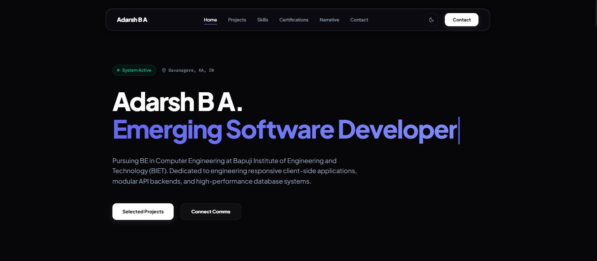

# ⚡ Adarsh B A · Final Architecture Portfolio
  
**A high-performance, interactive, and mechanically advanced portfolio designed for the modern web.**   Built with raw HTML, CSS, and Vanilla JavaScript to achieve peak performance without relying on heavy frameworks.

[Explore Live Demo](https://adhi.is-a.dev) · [Report a Vulnerability](SECURITY.md)

---

## 🚀 Core Architecture & Features

This is not a standard template. This portfolio is engineered from scratch with a heavy focus on performance, security, and developer-centric interactivity. It operates entirely as a **Static Client Application (PWA)** supported by serverless cloud integrations.

| Feature | Description |
| :--- | :--- |
| **📱 WebRTC Ecosystem Sync (P2P)** | A zero-latency peer-to-peer tunnel powered by `PeerJS`. Scan a QR code on your mobile device to instantly turn your phone into a live remote control for the desktop view. |
| **🚧 Zero-Latency Maintenance Protocol** | A centralized, Supabase-driven maintenance overlay injected into the `<head>` of all HTML files. It instantly locks down the UI with a custom dark-mode aesthetic without redirects or flashing. |
| **🛡️ Serverless Contact Pipeline** | Form submissions bypass standard API routes and use a custom, sanitized Google Apps Script proxy. Securely handles dual-email dispatch via the **Resend API**. |
| **🔒 VIP Intelligence System** | A specialized, high-clearance feedback form that bypasses standard channels, routing critical information directly to administrative oversight with red-alert priority. |
| **⚡ Service Worker (PWA)** | Utilizes a local `sw.js` Service Worker to heavily cache network requests, fonts, and assets, allowing the portfolio to load instantly and function fully offline. |
| **🎨 Dynamic GPU-Accelerated Styling** | Zero CSS Frameworks. Pure Vanilla CSS using CSS Variables, hardware-accelerated animations, and smooth glassmorphism effects tailored for both an *Obsidian Dark* and an *Alpine Light* mode. |
| **🔐 F12 Developer CTF Protocol** | An integrated easter egg designed for developers who open the browser console. It features a brute-force lockout mechanism and utilizes the Web Crypto API to validate a SHA-256 hash. |
| **🌐 Edge Personalization** | Uses the IP Geolocation API to display server proximity and latency, accompanied by a high-performance WebGL Data Visualization for system architecture. |

---

## 🛠️ Technologies Used

- **Frontend Foundation:** HTML5, CSS3, Vanilla ES6 JavaScript
- **3D & Visuals:** Three.js, Canvas Confetti, Feather Icons, QRCode.js
- **Networking & Real-Time:** WebRTC (PeerJS), Fetch API
- **Backend Proxy & Email:** Google Apps Script (Serverless), Resend API

---

## 🛡️ Privacy & Security

All backend logic, database operations, and API keys are strictly hidden from this repository and run securely on cloud infrastructure. The static files hosted here represent the client presentation layer exclusively. 

For vulnerability reporting or security concerns, please read our strict **[Security Policy](SECURITY.md)** and contact `security@adhi.is-a.dev`.

---

## 🤝 Contributing

We welcome structural improvements and architectural optimizations. Please see our **[Contributing Guidelines](CONTRIBUTING.md)** for details on how to get started, and ensure you adhere strictly to our **[Code of Conduct](CODE_OF_CONDUCT.md)**.

---

  
*Designed and Engineered by [Adarsh B A](https://www.linkedin.com/in/developeradhi) (2026).* 
Released under the [MIT License](LICENSE).

